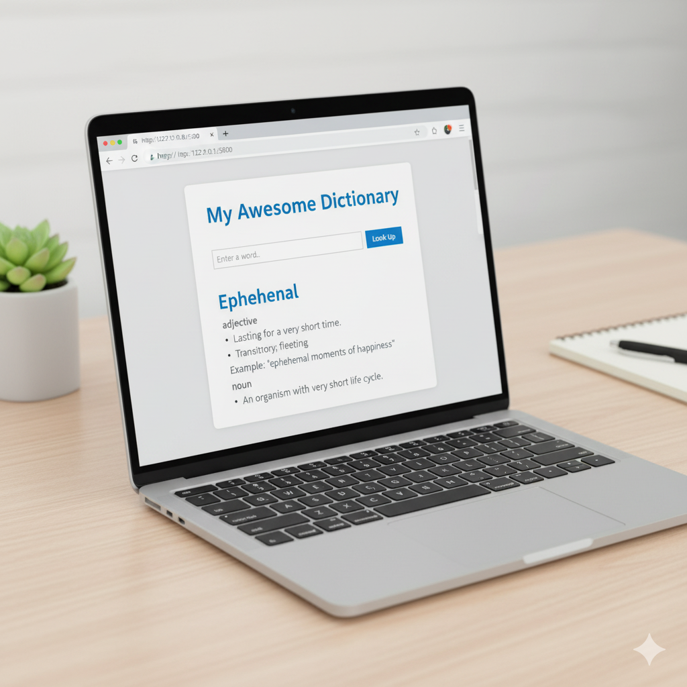

# My Dictionary Web App

A simple and interactive dictionary web application built with Flask (Python), HTML, and CSS. This app allows users to search for words and get their definitions, part of speech, and example usages by leveraging a free external dictionary API.



## ✨ Features

*   **Word Search:** Easily look up definitions for any English word.
*   **Detailed Definitions:** Get comprehensive definitions, including part of speech and multiple meanings.
*   **Example Sentences:** See words used in context with example sentences where available.
*   **Clean UI:** A user-friendly interface powered by basic HTML and CSS for a pleasant experience.
*   **Flask Backend:** Robust Python Flask backend handling API requests, data processing, and dynamic content rendering.

## 🚀 Technologies Used

*   **Python 3.x:** The core programming language for the backend logic.
*   **Flask:** A lightweight micro web framework for Python, used for handling routes and serving web pages.
*   **Requests:** A popular Python library for making HTTP requests to external APIs.
*   **HTML5:** Used for structuring the content of the web page.
*   **CSS3:** For styling the user interface, making it visually appealing and responsive.
*   **Free Dictionary API:** An external, publicly available REST API used to fetch word definitions.
    *   API Endpoint: `https://api.dictionaryapi.dev/api/v2/entries/en/<word>`

## 📁 Project Structure

The project follows a standard Flask application structure:

```
dictionary_app/
├── templates/
│   └── index.html      # The main HTML template for the dictionary page
├── static/
│   └── style.css       # Stylesheet for the application's look and feel
└── app.py              # The main Flask application file with backend logic
```

## ⚙️ Setup and Installation

Follow these steps to get your dictionary web app up and running on your local machine.

### 1. Clone the Repository (or create files manually)

If you have this project in a Git repository, clone it:

```bash
git clone https://github.com/your-username/dictionary_app.git # Replace with your repo URL
cd dictionary_app
```

If you're creating the files manually, ensure you have the `dictionary_app` directory with `app.py`, `templates/index.html`, and `static/style.css` in their correct places as shown in the project structure.

### 2. Create a Virtual Environment (Recommended)

It's highly recommended to use a virtual environment to isolate your project's dependencies from your system-wide Python packages.

```bash
python -m venv venv
```

### 3. Activate the Virtual Environment

*   **On macOS/Linux:**
    ```bash
    source venv/bin/activate
    ```
*   **On Windows (Command Prompt):**
    ```bash
    .\venv\Scripts\activate
    ```
*   **On Windows (PowerShell):**
    ```bash
    .\venv\Scripts\Activate.ps1
    ```

### 4. Install Dependencies

Install the necessary Python packages using pip:

```bash
pip install Flask requests
```

### 5. Run the Application

Once all dependencies are installed, you can start the Flask development server:

```bash
python app.py
```

### 6. Access the Application

Open your web browser and navigate to the local server address:

```
http://127.0.0.1:5000
```

You should now see the dictionary web page, ready for you to search for words!

## 💡 How to Use

1.  Enter a word into the search bar.
2.  Click the "Look Up" button.
3.  The definition(s) and related information will appear below the search bar.

## 🤝 Contributing

Contributions are welcome! If you have suggestions for improvements, bug fixes, or new features, please feel free to:

1.  Fork the repository.
2.  Create a new branch (`git checkout -b feature/YourFeatureName`).
3.  Make your changes.
4.  Commit your changes (`git commit -m 'Add some feature'`).
5.  Push to the branch (`git push origin feature/YourFeatureName`).
6.  Open a Pull Request.

## 📄 License

This project is open source and available under the MIT License. See the `LICENSE` file for more details.
```

Now, when you render this `README.md` file (e.g., on GitHub), the image will be displayed prominently at the top, giving a great first impression of your project!